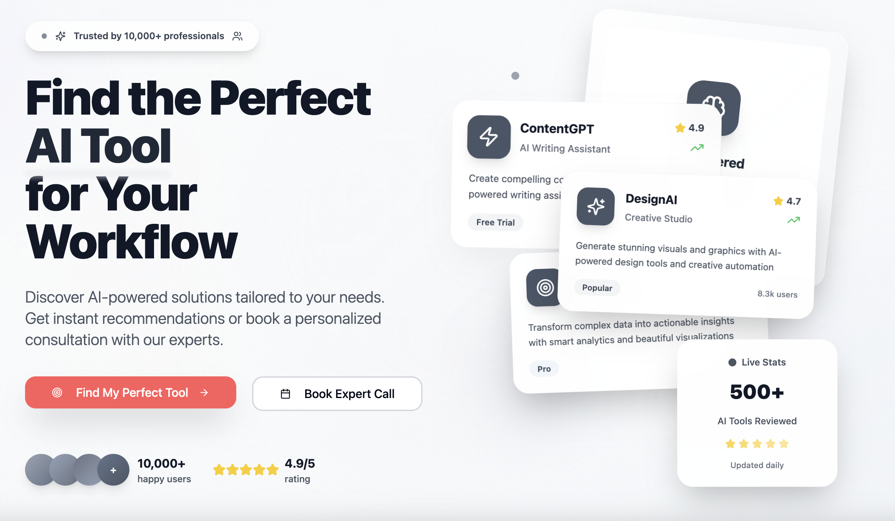

# ToolJunction - Find the Perfect AI Tool for Your Workflow

Love it or hate it, but you can't ignore AI tools.

These tools are 100x your productivity.

Welcome to ToolJunction - your ultimate destination for discovering and comparing the best AI tools. In today's rapidly evolving tech landscape, finding the right AI tool can be overwhelming. We've curated over 500+ cutting-edge AI tools across various categories, from content creation to coding, design to data analysis.

🚀 Why ToolJunction?
- Expert-vetted tools with detailed reviews
- Real user ratings and experiences
- Daily updates with latest AI innovations
- Personalized recommendations based on your workflow
- Compare features and pricing in one place

Whether you're a developer, designer, marketer, or content creator, we help you find the perfect AI companion for your specific needs.

## Categories

- [Image Generation & Design](#image-generation--design)
- [Image Enhancement & Editing](#image-enhancement--editing)
- [Video Creation & Editing](#video-creation--editing)
- [Audio & Music](#audio--music)
- [Content & Writing](#content--writing)
- [Development & Coding](#development--coding)
- [Marketing & SEO](#marketing--seo)
- [Productivity & Automation](#productivity--automation)
- [AI Chatbots & Assistants](#ai-chatbots--assistants)
- [3D & VR](#3d--vr)

## Image Generation & Design

| Tool Name | Main Use Cases | Suitable Job Roles | View Tool |
|-----------|---------------|-------------------|-----------|
| DALL-E 3 | • Advanced image generation • Creative visualization • Design ideation | • Artists • Designers • Creative Professionals | [View Tool](http://www.tooljunction.io/ai-tools/dall-e-3) |
| Krea AI | • Real-time image generation • Animation • Creative design | • Graphic Designers • Digital Artists • Content Creators | [View Tool](http://www.tooljunction.io/ai-tools/krea) |
| Dezgo | • High-quality image generation • Inpainting & upscaling • Background removal | • Graphic Designers • Content Creators • Digital Marketers | [View Tool](http://www.tooljunction.io/ai-tools/dezgo) |
| Craiyon | • Quick image generation • Artistic exploration • Concept visualization | • Artists • Hobbyists • Content Creators | [View Tool](http://www.tooljunction.io/ai-tools/craiyon) |
| Freepik AI | • Professional visuals • Custom image generation • Marketing graphics | • Graphic Designers • Marketers • Content Creators | [View Tool](http://www.tooljunction.io/ai-tools/freepik-ai-image-generator) |

## Image Enhancement & Editing

| Tool Name | Main Use Cases | Suitable Job Roles | View Tool |
|-----------|---------------|-------------------|-----------|
| Palette.fm | • Photo colorization • B&W image enhancement • Color customization | • Photographers • Designers • Archivists | [View Tool](http://www.tooljunction.io/ai-tools/palette-fm) |
| HitPaw Online | • Photo enhancement • Background removal • Watermark removal | • Content Creators • Photographers • Marketers | [View Tool](http://www.tooljunction.io/ai-tools/hitpaw-online) |

## Video Creation & Editing

| Tool Name | Main Use Cases | Suitable Job Roles | View Tool |
|-----------|---------------|-------------------|-----------|
| RunwayML | • Video generation • Creative editing • Collaborative projects | • Video Editors • Filmmakers • Content Creators | [View Tool](http://www.tooljunction.io/ai-tools/runwayml) |
| Descript | • Video/audio editing • Transcription • Voice cloning | • Content Creators • Podcasters • Video Editors | [View Tool](http://www.tooljunction.io/ai-tools/descript) |
| Mootion | • Visual storytelling • Script-to-video • Content creation | • Content Creators • Marketers • Storytellers | [View Tool](http://www.tooljunction.io/ai-tools/mootion) |
| BIGVU | • Teleprompter integration • Professional editing • Caption generation | • Content Creators • Presenters • Marketing Teams | [View Tool](http://www.tooljunction.io/ai-tools/bigvu) |
| Fylm.ai | • Color grading • LUT creation • Team collaboration | • Video Editors • Colorists • Production Teams | [View Tool](http://www.tooljunction.io/ai-tools/fylm-ai) |
| ImagineClip | • AI video generation • Avatar clips • Stylized social content | • Content Creators • Marketers • Social Media Teams | [View Tool](https://imagineclip.com) |

## Audio & Music

| [CharaVox](https://charavox.com) | AI voice generation platform with character voices, voice cloning, and studio-quality TTS in 6 languages (en/zh/ja/ko/es/pt). Powered by VoxCPM. |
| Tool Name | Main Use Cases | Suitable Job Roles | View Tool |
|-----------|---------------|-------------------|-----------|
| Moises | • Audio separation • Music practice • Chord detection | • Musicians • Music Teachers • Content Creators | [View Tool](http://www.tooljunction.io/ai-tools/moises-the-musicians-app) |
| BanterAI | • AI voice avatars • Fan engagement • Voice interaction | • Influencers • Content Creators • Community Managers | [View Tool](http://www.tooljunction.io/ai-tools/banterai) |
| ai\|coustics | • Audio enhancement • Noise reduction • Speech clarity | • Podcasters • Video Creators • Audio Engineers | [View Tool](http://www.tooljunction.io/ai-tools/aicoustics) |
| Mubert | • AI music generation • Royalty-free tracks • Custom soundtracks | • Content Creators • Developers • Streamers | [View Tool](http://www.tooljunction.io/ai-tools/mubert) |

## Content & Writing

| Tool Name | Main Use Cases | Suitable Job Roles | View Tool |
|-----------|---------------|-------------------|-----------|
| Cohesive AI | • Content creation • Workflow automation • Voice generation | • Content Marketers • Sales Teams • Support Teams | [View Tool](http://www.tooljunction.io/ai-tools/cohesive-ai) |
| Claude | • Writing assistance • Code generation • Research & analysis | • Writers • Developers • Researchers | [View Tool](http://www.tooljunction.io/ai-tools/claude) |
| PolitePost | • Email refinement • Professional writing • Tone adjustment | • Business Professionals • Students • Non-native Speakers | [View Tool](http://www.tooljunction.io/ai-tools/polite-post) |

## Development & Coding

| Tool Name | Main Use Cases | Suitable Job Roles | View Tool |
|-----------|---------------|-------------------|-----------|
| GPT Pilot | • Automated app development • Code generation • Full-stack applications | • Software Developers • Startup Founders • Technical Leads | [View Tool](http://www.tooljunction.io/ai-tools/gpt-pilot) |
| Cursor | • AI-powered coding • Code refactoring • Natural language coding | • Software Developers • Frontend/Backend Devs • Data Scientists | [View Tool](http://www.tooljunction.io/ai-tools/cursor) |
| Pinokio | • AI app automation • Local development • One-click setup | • Developers • AI Researchers • Tech Enthusiasts | [View Tool](http://www.tooljunction.io/ai-tools/pinokio) |

## Marketing & SEO

| Tool Name | Main Use Cases | Suitable Job Roles | View Tool |
|-----------|---------------|-------------------|-----------|
| Localo | • Local SEO optimization • Business profile management • Review tracking | • Business Owners • Digital Marketers • SEO Specialists | [View Tool](http://www.tooljunction.io/ai-tools/localo) |
| Kendal | • Social media content • Image creation • Post management | • Social Media Managers • Digital Marketers • Content Creators | [View Tool](http://www.tooljunction.io/ai-tools/kendal) |
| NotFair | • SEO site analysis & keyword research • Google Ads & Meta Ads management • GEO optimization & schema markup | • SEO Specialists • Digital Marketers • Paid Ads Managers | [View Tool](https://github.com/nowork-studio/NotFair) |

## Productivity & Automation

| Tool Name | Main Use Cases | Suitable Job Roles | View Tool |
|-----------|---------------|-------------------|-----------|
| Cheat Layer | • No-code automation • Business process automation • Task management | • Business Owners • Operations Managers • Team Leaders | [View Tool](http://www.tooljunction.io/ai-tools/cheat-layer) |
| timeOS | • Meeting note automation • Transcription services • Follow-up management | • Project Managers • Team Leaders • Executives | [View Tool](http://www.tooljunction.io/ai-tools/timeos) |

## AI Chatbots & Assistants

| Tool Name | Main Use Cases | Suitable Job Roles | View Tool |
|-----------|---------------|-------------------|-----------|
| ChatHub | • Multi-chatbot interaction • Response comparison • AI communication | • Researchers • Content Creators • Business Analysts | [View Tool](http://www.tooljunction.io/ai-tools/chathub) |
| GPT4All | • Offline AI processing • Private AI interactions • Local language models | • Privacy Advocates • Developers • Researchers | [View Tool](http://www.tooljunction.io/ai-tools/gpt4all) |
| Faraday.dev | • Offline LLM usage • Private AI chat • Customizable interactions | • Writers • Educators • Researchers | [View Tool](http://www.tooljunction.io/ai-tools/faraday-dev) |

## 3D & VR

| Tool Name | Main Use Cases | Suitable Job Roles | View Tool |
|-----------|---------------|-------------------|-----------|
| Skybox AI | • 360° environment creation • VR content • Panoramic scenes | • Game Developers • VR Designers • Architects | [View Tool](http://www.tooljunction.io/ai-tools/skybox-ai) |

## Academic & Writing

| Tool Name | Main Use Cases | Suitable Job Roles | View Tool |
|-----------|---------------|-------------------|-----------|
| PaperTyper | • Essay generation • Grammar checking • Citation formatting | • Students • Educators • Researchers | [View Tool](http://www.tooljunction.io/ai-tools/papertyper-ai-essay-writer) |

## Research & Analysis

| Tool Name | Main Use Cases | Suitable Job Roles | View Tool |
|-----------|---------------|-------------------|-----------|
| GeoSpy AI | • Image location analysis • Geographic verification • Investigation support | • Researchers • Investigators • Journalists | [View Tool](http://www.tooljunction.io/ai-tools/geospy-ai) |

---

## Why Use Our Directory?

1. **Comprehensive Categories**: Tools organized by function and use case for easy discovery
2. **Detailed Information**: Clear descriptions of use cases and target users
3. **Direct Access**: Quick links to try tools on tooljunction.io
4. **Regular Updates**: Continuously updated with new and emerging AI tools

## Contributing

We welcome contributions to this directory! If you know of an AI tool that should be included, please [submit a tool](https://www.tooljunction.io/submit-tool) here.

- [Submit a Tool](https://www.tooljunction.io/submit-tool)

## Visit Tool Junction

For a more interactive experience and detailed information about each tool, visit [Tool Junction](http://www.tooljunction.io).
